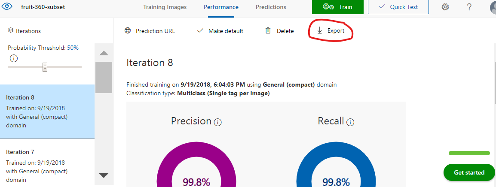
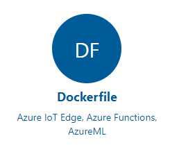
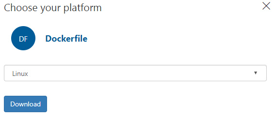

# Image Classification running on Azure IoT Edge

The scenarios I had in mind when developing this Machine Learning Image Classification solution was self-service shopping for someone with impaired vision or maybe someone new to a country who might not know the local name of a product.

## Solution Overview

At a high level, the solution takes a photo of a piece of fruit, gets the name of the fruit from a trained image classifier, converts the name of the fruit to speech and plays back the name of the fruit on the attached speaker.

The solution runs of [Azure IoT Edge](#azure-iot-edge-overview) and consists of a number of services.

1. The **Camera Capture Module** is responsible for capturing an image from the camera, calling the Image Classification REST API, then calling the Text to Speech REST API and finally playing bask in the classified image label on the speaker.  

2. The **Image Classification Module** is responsible for classifying the image that was passed to it from the camera capture module.

3. The **Text to Speech Module** passes the text label return from the image classifier module and converts to speech using the Azure Speech Service. As an optimization, this module also caches speech data.

4. USB Camera for Image Capture is used for image capture.

5. A Speaker for text to Speech playback.

6. I used the free tier of **Azure IoT Hub** for managing, deploying and reporting the IoT Edge device.

7. The **Azure Speech to Text service** free tier was used for text to speech services.

8. And **Azure Custom Vision** was used to build the Image Classification model that forms the basis of the Image Classification module.


## What is Azure IoT Edge?

The solution is built on [Azure IoT Edge](https://docs.microsoft.com/en-us/azure/iot-edge/) which is supported on Linux and Windows devices. If you are not familiar with Azure IoT Edge then as a brief introduction it part of the Azure IoT Hub service, and is used to define, secure and deploy a solution to a device or set of devices. It also provides cloud-based central monitoring and reporting of device state.

### Azure IoT Edge

The main components for an IoT Edge solution are:-

1. The [IoT Edge Runtime](https://docs.microsoft.com/en-us/azure/iot-edge/iot-edge-runtime) consists of two main components. The **IoT Edge "hub"** which is responsible for communications, and the **IoT Edge "agent"** which is responsible for running and monitoring modules to the local device.

2. [Modules](https://docs.microsoft.com/en-us/azure/iot-edge/iot-edge-modules). A module is a unit of deployment, it is a docker image stored in a registry such as the [Azure Container Registry](https://azure.microsoft.com/en-au/services/container-registry/), or [Docker Hub](https://hub.docker.com/). Modules can be custom developed, built as [Azure Functions](https://docs.microsoft.com/en-us/azure/iot-edge/tutorial-deploy-function), or as services exported from [Azure Custom Vision](https://docs.microsoft.com/en-us/azure/iot-edge/tutorial-deploy-stream-analytics), [Azure Machine Learning](https://docs.microsoft.com/en-us/azure/iot-edge/tutorial-deploy-machine-learning), or [Azure Stream Analytics](https://docs.microsoft.com/en-us/azure/iot-edge/tutorial-deploy-stream-analytics).

3. Routes. Routes define message paths between modules and with IoT Hub.

4. Create Options. Create Options tell Docker runtime what options to start the Module/Docker Container with. For example, you may wish to open ports for REST APIs or debugging ports, define paths to devices such as a USB Camera, set environment variables, or enable privilege mode for certain hardware operations.

5. [Deployment Manifest](https://docs.microsoft.com/en-us/azure/iot-edge/module-composition). The Deployment Manifest tells the IoT Edge runtime what modules to deploy and what container registry to pull them from and includes the routes and create options information.

Be sure to check out the complete [Azure IoT Edge](https://docs.microsoft.com/en-us/azure/iot-edge/) documentation for more information, including a video introduction and developer tutorials.

## Architectural Considerations

So with that overview of Azure IoT Edge here were my initial considerations and constraints for the solution.

1. The solution should scale from a Raspberry Pi (running Raspbian Linux) on ARM32v7, to my desktop development environment, to an industrial capable IoT Edge device such as those found in the [Certified IoT Edge Catalog](https://catalog.azureiotsolutions.com/).

2. The solution required camera input, I used a USB Webcam for image capture as it was supported across all target devices.

3. The camera capture module required Docker USB device pass-through (not supported by Docker on Windows) so that plus targeting Raspberry Pi meant that I need to target Azure IoT Edge on Linux.

4. I wanted my developer experience to mirror the devices I was targeting plus I needed Docker support for the USB webcam, so I developed the solution from Ubuntu 18.04. See my [Ubuntu for Azure Developers](https://gloveboxes.github.io/Ubuntu-for-Azure-Developers/) guide.

    - As a workaround, if your development device is locked to Windows then use Ubuntu in Virtual Box which allows USB device pass-through which you can then pass-through to Docker in the Virtual Machine. A bit convoluted but it does work.

## Azure Services

### Creating the Fruit Classification Model

The [Azure Custom Vision](https://customvision.ai/) service is a simple way to create an image classification machine learning model without having to be a data science or machine learning expert. You simply upload collections of labeled images. For example, you upload a collection of bananas and you label them 'bananas'. 

To create your own classification model read [How to build a classifier with Custom Vision](https://docs.microsoft.com/en-us/azure/cognitive-services/custom-vision-service/getting-started-build-a-classifier) for more information. It is important to have a good variety of labeled images so be sure to read [How to improve your classifier](https://docs.microsoft.com/en-us/azure/cognitive-services/custom-vision-service/getting-started-improving-your-classifier) for more information.

### Exporting an Azure Custom Vision Model

This "Image Classification" module in this sample includes a simple fruit classification model that was exported from Azure Custom Vision. Be sure to read how to [Export your model for use with mobile devices](https://docs.microsoft.com/en-us/azure/cognitive-services/custom-vision-service/export-your-model). It is important to select one of the "**compact**" domains from the project settings page otherwise you will not be able to export the model.

#### To export your model

1. From the **Performance** tab of your Custom Vision project click **Export**.

    

2. Select Dockerfile from the list of available options

    

3. Then select the Linux version of the Dockerfile.

   

4. Download the docker file and unzip and you have a ready-made Docker solution containing a Python Flask REST API. This was how I created the Azure IoT Edge Image Classification module. Too easy:)

## IoT Edge Modules


## How to Deploy

### Follow notes from the IoT Hub Tutorial

[Quickstart: Deploy your first IoT Edge module to a Linux x64 device](https://docs.microsoft.com/en-us/azure/iot-edge/quickstart-linux)

### GitHub Clone

### Direct from Portal


## Developing IoT Edge Solutions on Linux

Focus of this article are my experiences building an Azure IoT Edge solution with Python and targeting IoT Edge running on a Linux Host, both desktop x64 and arm32v7 (Raspberry Pi).

This article should be read in conjunction with the [Azure IoT Edge documents and tutorials](https://docs.microsoft.com/en-us/azure/iot-edge/).

## Developer Productivity

Building for IoT Edge is not too dissimilar from building a mobile app as there is a level of indirection as soon as you start developing, deploying and testing your code to a device. Everything becomes slower from deploying code across the network, to starting the code on a lower powered device, to remotely attaching a debugger. My recommendation is that you aim to build and test as much as you can on your developer machine before you start deploying and testing on an Iot Edge device.

### Solution architecture

Think of your solution as a set of (micro) services with defined contracts that can communicate via messages or REST calls. In the world of IoT Edge these are called modules and are synonymous with Docker containers. You should code defensively across network boundaries and plan for failure using various [circuit breaker](https://en.wikipedia.org/wiki/Circuit_breaker_design_pattern)/backoff strategies because at some point the services you call will not be available for a number of reasons including but not limited to service updates.

The following example is the approach I took for backing off requests to the Image Classification Service.

```python
maxRetry = 4
retry = 0
while retry < maxRetry:
    try:
        response = requests.post(self.imageProcessingEndpoint, headers=headers,
                                params=self.imageProcessingParams, data=frame)
        break
    except:
        retry = retry + 1
        print('Image Classification REST Endpoint - Retry attempt # ' + str(retry))
        time.sleep(retry)

if retry >= maxRetry:
    return []
```

### Naming Convention

As a general rule use lower case names for modules. This is especially important if making REST calls from Python modules as the Python Requests
package and the get call will lower case the endpoint name and the IoT Edge runtime will not resolve the request against modules that use mixed case names.

1. Environment variables - UPPERCASE
2. Modules Names in lowercase

Modules you need to write and modules you don’t

Microsoft 1st party

- https://docs.microsoft.com/en-au/azure/stream-analytics/stream-analytics-edge 
- https://docs.microsoft.com/en-us/azure/iot-edge/how-to-store-data-blob 
- https://docs.microsoft.com/en-us/azure/iot-edge/how-to-ci-cd 

IoT Edge Extensions

Use the Visual Studio IoT Edge Extension to scaffold your solution. This will create your project structure, the modules, dockerfiles and the deployment.json file which instructs IoT Edge what modules to load their version and location to pull from.

There is nothing to stop you closing the overall solution and opening each individual module in Visual Studio Code. It can make the development simpler, and enable others to work on other modules more easily. 

Building for IoT edge is like building for mobile, the code, deploy, test, debug cycle is elongated as there is a degree of indirection. Everything takes longer as you typically need to get the code to the device, starting a remote debugging session takes longer, stepping through the code over a network connect is slower etc - you get the idea.

Exceptions

Ensure all REST calls to modules are wrapped in exception handlers with some sort of retry/back off mechanism as modules maybe be in indeterminate states - it could be starting after a system boot, it might be being updated and the IoT Edge runtime has torn down the existing module in readiness to start the new version of the module. 

Build as much as you can on your development PC

So when building a solution develop as much as you can on your developer desktop and mock out physical sensors that you may not have access to on your desktop. The easiest way is to set an environment variable to toggle between mocked and real sensors. Make a note of all of the Python PIP packages you use as you'll need to added them to the docker pip requirements file when you come to build the docker image.

Mock out REST APIs with Function Proxies

See Dean's article on Function proxies

Linux example

Windows example

Python example with .env file

So you have a viable module to start testing with IoT Edge 

First you need to Dockerise your module. When you created a module with IoT Edge it also created dockerfile as a start point for your solution.
You'll need to customize the dockerfile to ensure all the prerequisites libraries and Python packages for the module are loaded in to the image. 

If you are cross compiling for another processor architecture then allow a lot of time for building an image - the example … 
took close to an hour to build.

Dockerise

If possible then use the same Docker base image as it will reduce the number of docker layers that need to be distributed to a device. 

https://hub.docker.com/r/microsoft/azureiotedge-azure-stream-analytics/ 

## IoT Edge Module Create Options

Build local, then Dockerise then wrap up as an IoT Module

1. Run a Local Docker Registry

- https://docs.docker.com/registry/deploying/
- docker run -d -p 5000:5000 --restart=always --name registry registry:2

## Disk Space Management

Docker images accumulate fast and gobble up disk space. So run a regular job to clean up old containers and images.

## Debugging

1. Python 4 and multi Threaded
2. https://code.visualstudio.com/docs/python/debugging
3. [Flask Apps](https://code.visualstudio.com/docs/python/debugging#_flask-debugging)
4. Local into a container running in the context of Iot Edge

## Microsoft 1st Party Modules


6. Desired Properties. Desired Properties allows you to set module properties or state from the Azure IoT Hub service web portal or your own service. Desired properties are set via a module (device) twin which is a JSON document stored in IoT Hub, that contains desired state information for a module.